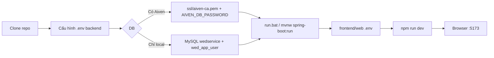

# Hướng dẫn chạy dự án TravelViet Booking System (A → Z)

> Tài liệu đầy đủ cho Windows (PowerShell). Mac/Linux chỉ đổi lệnh tương đương (`./mvnw` thay `.\mvnw.cmd`).

---

## Mục lục

1. [Dự án gồm những gì?](#1-dự-án-gồm-những-gì)
2. [Cài phần mềm cần thiết](#2-cài-phần-mềm-cần-thiết)
3. [Clone mã nguồn](#3-clone-mã-nguồn)
4. [Cấu hình database](#4-cấu-hình-database)
5. [Cấu hình Backend](#5-cấu-hình-backend)
6. [Chạy Backend](#6-chạy-backend)
7. [Cấu hình & chạy Frontend Web](#7-cấu-hình--chạy-frontend-web)
8. [Chạy Mobile (tùy chọn)](#8-chạy-mobile-tùy-chọn)
9. [Kiểm tra đã chạy đúng](#9-kiểm-tra-đã-chạy-đúng)
10. [Tài khoản test / API](#10-tài-khoản-test--api)
11. [MinIO & Gemini (tùy chọn)](#11-minio--gemini-tùy-chọn)
12. [Lỗi thường gặp](#12-lỗi-thường-gặp)
13. [Tóm tắt lệnh nhanh](#13-tóm-tắt-lệnh-nhanh)

---

## 1. Dự án gồm những gì?

```text
TRAVELVIET-BOOKING-SYSTEM/
├── backend/          ← API Spring Boot (port 8088, path /api/v1)
├── frontend/web/     ← Website React + Vite (thường port 5173)
└── frontend/mobile/  ← App Expo (tùy chọn)
```

**Luồng chạy chuẩn khi dev:**

1. Database (MySQL cloud Aiven **hoặc** MySQL local)
2. Backend
3. Frontend Web mở trình duyệt

---

## 2. Cài phần mềm cần thiết

| Phần mềm | Phiên bản gợi ý | Kiểm tra |
|----------|-----------------|----------|
| **Git** | Mới nhất | `git --version` |
| **Java JDK** | **21** (bắt buộc) | `java -version` |
| **Maven** | Không bắt buộc (dùng `mvnw` trong repo) | — |
| **Node.js** | **20 LTS** trở lên | `node -v` |
| **npm** | Đi kèm Node | `npm -v` |
| **MySQL** | 8.x (chỉ cần nếu dùng DB local fallback) | Workbench hoặc `mysql` CLI |

**Tùy chọn:**

- **Docker** — nếu chạy MySQL/MinIO bằng container
- **Expo Go** trên điện thoại — nếu dev mobile

---

## 3. Clone mã nguồn

```powershell
cd D:\Documents\WED_SERVICE
git clone https://github.com/HOANGDINHTUNG/TRAVELVIET-BOOKING-SYSTEM.git
cd TRAVELVIET-BOOKING-SYSTEM
```

(Nếu bạn đã có folder `travelviet-booking-system` thì `cd` vào đó, bỏ bước clone.)

---

## 4. Cấu hình database

Backend hỗ trợ **2 chế độ** (xem chi tiết `backend/docs/DATABASE_FAILOVER.md`):

| Chế độ | Khi nào dùng |
|--------|----------------|
| **Aiven (cloud) ưu tiên** | Có mạng, đã có service MySQL trên Aiven |
| **Local fallback** | Cloud lỗi → tự chuyển MySQL máy bạn |

### 4A. Chỉ dùng MySQL trên máy (đơn giản nhất lúc đầu)

**Bước 1 — Mở MySQL Workbench** (hoặc `mysql` CLI) với user `root`, chạy:

```sql
CREATE DATABASE IF NOT EXISTS wedservice
  CHARACTER SET utf8mb4 COLLATE utf8mb4_unicode_ci;

CREATE USER IF NOT EXISTS 'wed_app_user'@'%' IDENTIFIED BY '123456';
GRANT ALL PRIVILEGES ON wedservice.* TO 'wed_app_user'@'%';

SET GLOBAL log_bin_trust_function_creators = 1;
FLUSH PRIVILEGES;
```

**Bước 2 — Port MySQL**

- Repo mặc định kết nối local: `127.0.0.1` port **`3307`**
- Nếu MySQL của bạn chạy port **3306**, sửa trong `.env`: `DB_PORT=3306`

**Bước 3 — Script tự tạo user (khuyến nghị trên Windows)**

```powershell
cd backend
.\scripts\ensure-mysql-dev-user.ps1 -MysqlRootUser root -MysqlRootPassword "mat-khau-root-cua-ban"
```

**Bước 4 — Tắt cloud, chỉ local** trong `backend/.env`:

```properties
DB_FAILOVER_ENABLED=false
```

Hoặc **không** đặt `AIVEN_DB_PASSWORD` → backend bỏ qua Aiven.

---

### 4B. Dùng Aiven (cloud) + giữ local khi mất mạng

**Bước 1 — Trên Aiven Console**

1. Vào service **MySQL** → **Connection information**
2. Ghi lại: **Host**, **Port**, **User** (`avnadmin`), **Database** (`defaultdb`)
3. Bấm **Reveal password** → copy mật khẩu
4. **CA certificate** → Download → lưu file:

   ```text
   backend/ssl/aiven-ca.pem
   ```

**Bước 2 — File `backend/.env`**

Sao chép mẫu:

```powershell
cd backend
copy .env.example .env
notepad .env
```

Điền tối thiểu:

```properties
# --- Local (fallback) ---
DB_FAILOVER_ENABLED=true
DB_HOST=127.0.0.1
DB_PORT=3307
DB_NAME=wedservice
DB_USERNAME=wed_app_user
DB_PASSWORD=123456

# --- Aiven (cloud) ---
AIVEN_DB_ENABLED=true
AIVEN_DB_HOST=mysql-lab-mtung3365-864a.f.aivencloud.com
AIVEN_DB_PORT=23132
AIVEN_DB_NAME=defaultdb
AIVEN_DB_USER=avnadmin
AIVEN_DB_PASSWORD=<dán-password-từ-aiven>
AIVEN_CA_CERT_PATH=backend/ssl/aiven-ca.pem

# --- JWT (dev) ---
JWT_SECRET=local-dev-jwt-secret-change-via-env-min-32-chars-ok
```

> **Lưu ý:** Không commit file `.env` lên Git (đã nằm trong `.gitignore`).

**Flyway:** Lần đầu chạy backend, Flyway tự tạo/cập nhật bảng trên DB đang kết nối (cloud **hoặc** local). Hai DB **không** đồng bộ dữ liệu với nhau.

---

## 5. Cấu hình Backend

### 5.1 Build lần đầu

```powershell
cd D:\Documents\WED_SERVICE\travelviet-booking-system\backend
.\mvnw.cmd clean install -DskipTests
```

Chờ đến khi thấy **BUILD SUCCESS**.

### 5.2 File cấu hình quan trọng

| File | Vai trò |
|------|---------|
| `backend/.env` | Mật khẩu DB, JWT, Gemini, VNPay… |
| `backend/src/main/resources/application-dev.yaml` | Profile dev, failover DB |
| `backend/src/main/resources/application.yaml` | Cấu hình chung, port **8088** |

Profile mặc định: **`dev`** (tự load `application-dev.yaml`).

---

## 6. Chạy Backend

Mở **PowerShell / Terminal 1**:

```powershell
cd backend
```

**Cách 1 — Khuyến nghị (có clean):**

```powershell
.\run.bat
```

**Cách 2 — Lệnh trực tiếp:**

```powershell
.\mvnw.cmd spring-boot:run -Dspring-boot.run.profiles=dev
```

### Log thành công

- Thấy dòng tương tự: `Started BackendApplication`
- Database:
  - Cloud: `Active database: REMOTE (Aiven cloud) — ...`
  - Local: `Active database: LOCAL (fallback) — 127.0.0.1:3307/wedservice`
- Flyway: các dòng `Migrating schema` / `Successfully applied`

### URL Backend

| Mục | Địa chỉ |
|-----|---------|
| Base API | `http://localhost:8088/api/v1` |
| Health | `http://localhost:8088/api/v1/actuator/health` |
| AI Chat | `POST http://localhost:8088/api/v1/ai/chat` |

**Giữ terminal này chạy** — đừng tắt khi đang dev frontend.

---

## 7. Cấu hình & chạy Frontend Web

Mở **Terminal 2** (terminal mới):

### 7.1 Cài package

```powershell
cd D:\Documents\WED_SERVICE\travelviet-booking-system\frontend\web
npm install
```

### 7.2 File `.env` cho Vite

```powershell
copy .env.example .env
notepad .env
```

Nội dung:

```properties
VITE_API_BASE_URL=http://localhost:8088/api/v1
```

(Nếu backend đổi port thì sửa cho khớp.)

### 7.3 Chạy dev server

```powershell
npm run dev
```

Terminal sẽ in URL, thường là:

```text
http://localhost:5173
```

Mở link đó bằng **Chrome / Edge**.

### 7.4 Build production (không bắt buộc khi dev)

```powershell
npm run build
npm run preview
```

---

## 8. Chạy Mobile (tùy chọn)

Terminal 3:

```powershell
cd frontend\mobile
npm install
npm run dev
```

Quét QR bằng **Expo Go**. Mobile cần cấu hình API trỏ đúng IP máy dev (không dùng `localhost` trên điện thoại thật — dùng IP LAN, ví dụ `http://192.168.1.10:8088/api/v1`).

---

## 9. Kiểm tra đã chạy đúng

### 9.1 Backend sống

Trình duyệt hoặc PowerShell:

```powershell
curl http://localhost:8088/api/v1/actuator/health
```

Kết quả có `"status":"UP"` (hoặc tương đương) là được.

### 9.2 Frontend gọi được API

1. Mở `http://localhost:5173`
2. F12 → tab **Network**
3. Tải trang chủ / danh sách tour → thấy request tới `localhost:8088/api/v1/...` status **200**

Nếu **CORS** hoặc **failed to fetch**: kiểm tra backend đang chạy và `VITE_API_BASE_URL` đúng.

### 9.3 Đăng nhập thử

Vào `/login` — nếu chưa có user, **đăng ký** tài khoản mới qua form Register (API `POST /auth/register`).

---

## 10. Tài khoản test / API

- Chi tiết user/role seed: xem `backend/API_DOCUMENTATION.md` mục **§2 Dữ liệu test**
- Sau khi Flyway chạy, DB có thể đã có user mẫu (tùy migration) — đọc API doc để biết email/password test

**Đăng ký tay:**

1. Mở web → **Đăng ký**
2. Hoặc gọi API:

```http
POST http://localhost:8088/api/v1/auth/register
Content-Type: application/json

{
  "email": "test@example.com",
  "password": "YourPass123!",
  "fullName": "Test User"
}
```

(Trường body có thể khác — xem DTO trong API doc.)

---

## 11. MinIO & Gemini (tùy chọn)

| Tính năng | Cần gì |
|-----------|--------|
| Upload ảnh destination (admin) | MinIO chạy `http://127.0.0.1:9000`, biến `MINIO_*` trong `.env` |
| AI Chat | `GEMINI_API_KEY` trong `backend/.env` |
| Thanh toán VNPay | `VNPAY_ENABLED=true` + TMN code, hash secret (sandbox) |

Không cấu hình vẫn chạy được phần lớn trang catalog, tour, booking cơ bản.

---

## 12. Lỗi thường gặp

### Backend không start — lỗi database

| Triệu chứng | Cách xử lý |
|-------------|------------|
| `Cannot connect to local database` | Bật MySQL; đúng `DB_PORT`; chạy script `ensure-mysql-dev-user.ps1` |
| SSL / certificate (Aiven) | Có file `backend/ssl/aiven-ca.pem` |
| `Access denied for user` | Sai password; user thiếu quyền; chạy lại GRANT SQL |
| Flyway validate failed | Trong dev đã bật `repair-on-migrate: true`; thử xóa DB dev và chạy lại (cẩn thận mất data) |

### Frontend trắng / không load tour

| Triệu chứng | Cách xử lý |
|-------------|------------|
| Network failed | Backend chưa chạy |
| 401 liên tục | Đăng nhập lại; xóa `sessionStorage` / `localStorage` token cũ |
| API URL sai | Sửa `VITE_API_BASE_URL` trong `frontend/web/.env`, **restart** `npm run dev` |

### Port bị chiếm

```powershell
netstat -ano | findstr :8088
netstat -ano | findstr :5173
```

Tắt process hoặc đổi port trong config.

### Java sai phiên bản

Dự án cần **Java 21**. Cài JDK 21 và đặt `JAVA_HOME`.

---

## 13. Tóm tắt lệnh nhanh

**Terminal 1 — Backend:**

```powershell
cd backend
# Đã có .env + MySQL/Aiven OK
.\run.bat
```

**Terminal 2 — Web:**

```powershell
cd frontend\web
# Đã có .env với VITE_API_BASE_URL
npm install
npm run dev
```

**Mở trình duyệt:** `http://localhost:5173`

---

## Sơ đồ luồng



---

## Tài liệu liên quan

| File | Nội dung |
|------|----------|
| `WEBSERVICE.md` | Hướng dẫn ngắn ban đầu |
| `backend/docs/DATABASE_FAILOVER.md` | Cloud + fallback local |
| `backend/API_DOCUMENTATION.md` | Toàn bộ API |
| `PROJECT_CV_SUMMARY.md` | Tổng hợp tech stack dự án |

---

*Nếu kẹt ở bước cụ thể, chụp log terminal (backend hoặc npm) để debug nhanh hơn.*
